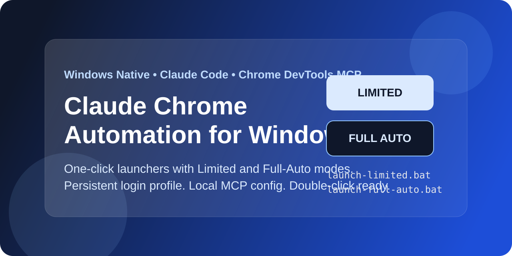

<p align="center">
  
</p>

<h1 align="center">Claude Chrome Automation for Windows</h1>

<p align="center">面向 Windows 的 Claude Code 浏览器自动化一键启动模板。</p>

<p align="center">
  <a href="https://github.com/davidchen99/claude-chrome-automation-windows/blob/main/README.md">English</a>
  ·
  <code>受限</code> 模式
  ·
  <code>全自动</code> 模式
</p>

这是一个专门给 Windows 用户准备的 Claude Code 浏览器自动化启动模板。

它不是单纯“把 Claude 连上 Chrome”。

它解决的是更实际的一层问题：

- 如何在 Windows 上一键启动浏览器自动化
- 如何保留登录态，避免反复登录
- 如何同时提供“受限模式”和“全自动模式”
- 如何让别人下载后尽量直接可用，而不是先改一堆配置

一句话概括：

把原本分散、容易踩坑的配置过程，整理成“下载后双击即可启动”的方案。

## 一眼看懂

- 双击即可启动，适合原生 Windows 使用
- 自动连接 `127.0.0.1:9222` 的专用 Chrome 调试实例
- 独立浏览器资料目录，可保留登录态
- 提供 `受限` 和 `全自动` 两种模式
- 本地 MCP 配置，不要求用户手改全局 Claude 设置

## 这个项目解决了什么问题

在 Windows 上，用 Claude Code 操控 Chrome，常见痛点有：

- `npx` 启动本地 MCP 服务不够稳定
- 想让 Claude 自动操作浏览器，但不想默认放开整个终端
- 普通用户不想自己手改 Claude 配置文件
- 希望一键启动，而不是每次都手工开 Chrome 调试端口

这个项目把这些问题合并解决：

1. 自动启动专用 Chrome 调试实例
2. 自动让 Claude Code 连接到这个浏览器
3. 提供两种模式：受限版、全自动版

## 核心思路

整个工作流其实很简单：

1. 启动一个专用的 Chrome 调试会话
2. 让 Claude Code 通过本地 MCP 配置连接过去
3. 根据任务风险，选择“受限”还是“全自动”

真正的价值，不在于某一条命令，而在于把这三步打包成一个 Windows 用户能直接上手的模板。

## 模式区别

| 模式 | 适合场景 | 权限风格 |
| --- | --- | --- |
| `受限` | 日常网页抓取、点击、阅读、截图 | 偏浏览器自动化，更稳 |
| `全自动` | 高信任任务，希望 Claude 少确认 | `--dangerously-skip-permissions` |

## 创新点

### 1. 明确面向 Windows

很多教程是 Linux/macOS 逻辑，Windows 用户照着做经常会卡。

这个模板从一开始就按 Windows 设计：

- 使用 `cmd /c npx`
- 使用 `.bat` 双击启动
- 处理 Windows 下的路径和 Chrome 启动方式

### 2. 把“浏览器自动化”做成双模式产品

这不是单纯把 Claude 连上 Chrome。

而是把它做成两个可选入口：

#### 受限模式

- 优先放开浏览器自动化能力
- 限制通用终端命令
- 限制 `WebFetch`
- 更适合日常使用

#### 全自动模式

- 直接启用 `--dangerously-skip-permissions`
- Claude 更少被拦截
- 更适合高信任、高自动化场景

这让用户可以根据任务风险自己选模式。

### 3. 专用 Chrome 资料目录

这个模板不会直接依赖你平时乱开的 Chrome 窗口。

它会启动一个专用调试浏览器：

- 登录态可保留
- Cookie 可保留
- 自动化环境和日常浏览隔离

这样就能做到：

- 第一次登录一次
- 后面通常不必每次重新登录

### 4. 尽量做到即插即用

项目把 MCP 配置做成了本地文件，而不是让用户自己去改全局 Claude 配置。

因此用户只要具备：

- Claude Code
- Node.js
- Chrome

就可以直接双击启动。

## 适合谁

- 想让 Claude 自动浏览网页、点击网页、抓取网页内容的 Windows 用户
- 希望保留网站登录态、避免每次重登的人
- 不想自己折腾 MCP 配置的人
- 想在“更安全”与“更自动”之间自己选模式的人

## 目录结构

```text
claude-chrome-automation-windows/
  README.md
  README.zh-CN.md
  launch-limited.bat
  launch-full-auto.bat
  config/
    chrome-devtools.mcp.json
    limited-settings.json
  scripts/
    start-chrome-debug-9222.bat
```

## 使用方式

### 受限模式

双击：

- `launch-limited.bat`

适合：

- 网页抓取
- 浏览器点击
- 页面阅读
- 截图

### 全自动模式

双击：

- `launch-full-auto.bat`

适合：

- 需要 Claude 尽量少确认
- 你明确接受更高权限风险

## 使用建议

第一次启动后，在专用 Chrome 窗口里完成你要用的网站登录。

后面通常会保留登录态。

## 风险说明

### 受限模式

风险低于全自动，但不是零风险。

因为 Claude 仍然可以：

- 读取页面内容
- 点击页面按钮
- 操作已经登录的网站

### 全自动模式

风险明显更高。

因为它启用了：

- `--dangerously-skip-permissions`

适合高级用户，不适合无脑常开。

## 适合发布到 GitHub 的原因

这个项目不是单个脚本，而是一套清晰的 Windows 浏览器自动化启动方案。

它适合给其他人下载使用，因为它具备：

- 明确的场景定位
- 双模式区分
- 一键启动体验
- 专用浏览器资料隔离
- 本地化配置，不依赖复杂手改
